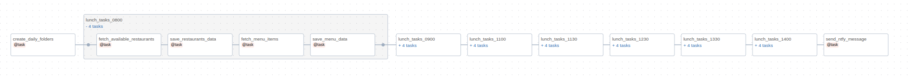

# Lunch Tracker

## Overview
This project is to get data from Lunch App, store in JSON format, then transform and save to database and in final step make it available for analytics.
I do not know if it will be anything interesting to analyze but I want to try. ;)

## Project Status
Gathering data.

## Tech Stack
- Python
- Airflow
    - self-hosted with Docker
- CursorAI


## Data Flow


### API
First step is to get data from Lunch App API. I discover how api woks checking Smart Lunch App website and using developer tools to find out how to get the data.
Exploring page I checked when API is called and what data is returned.

### Airflow
In dags/lunch_scraper.py file I created a DAG that is scheduled to run every day at 4 PM.

DAG is doing following:
- create_daily_foldersCreate folders for each day
- Get available restaurants for given day and time
- Get menu items for each restaurant
- Save data to JSON file

#### create_daily_folders
This function is creating folders for each day. Reason: better organization of data and easier to manage.

```python
@task
def create_daily_folders(date: str):
    """Create folders for the specified date"""
    base_paths = ["data/lunch_menu", "data/restaurants"]
    date_folder = date.replace("-", "_")
    
    for base_path in base_paths:
        daily_path = f"{base_path}/{date_folder}"
        os.makedirs(daily_path, exist_ok=True)
        print(f"Created directory: {daily_path}")
    
    return date_folder
```


#### fetch_available_restaurants
This function is getting available restaurants for given day and time.
I am alway checking next day and specific time which I specify in dag.
Each restaurant can deliver data on different time so I am checking all of them.
LOGIN and PASSWORD and URL for lunch app are saved in Airflow variables.

```python
@task
TIMES = [
"08:00",
"09:00",
"11:00",
"11:30",
"12:30",
"13:30",
"14:00",
]

def fetch_available_restaurants(date_str: str, time_str: str):
    """Task to get available restaurants"""
    url = (
        f"{URL}/employees/api/v3/menu_categories"
        f"?day={date_str}"
        f"&hour={time_str}"
        f"&delivery_place_id=1203"
    )
    session = Session()
    session.auth = (LOGIN, PASSWORD)
    response = session.get(url)
    response.raise_for_status()
    time.sleep(2)
    return response.json()
```


#### save_restaurants_data
This function is saving reastaurants data to JSON file.

```python
def save_restaurants_data(data: list, date: str, time: str):
    """Task to save available restaurants data"""
    if not data:
        return None
        
    date_folder = date.replace("-", "_")
    directory = f"data/restaurants/{date_folder}"
    filename = f"{directory}/available_restaurants_{date}.json"
    
    os.makedirs(directory, exist_ok=True)
    
    existing_data = []
    if os.path.exists(filename):
        with open(filename, 'r', encoding='utf-8') as f:
            existing_data = json.load(f)
    
    existing_data.extend(data)
    
    with open(filename, 'w', encoding='utf-8') as f:
        json.dump(existing_data, f, ensure_ascii=False, indent=2)
    print(f"Updated restaurants data in {filename} for time {time}")
    return data

```


#### fetch_menu_items
This function is getting menu items for each restaurant.

```python
    @task
    def fetch_menu_items(restaurant_data: list, date_str: str, time_str: str):
        """Task to fetch menu items for each restaurant"""
        if not restaurant_data: # Skip if no restaurant data
            print("No restaurant data received, skipping menu fetch")
            return None
            
        datetime_str = format_datetime(date_str, time_str)
        all_menu_data = []
        
        for restaurant in restaurant_data:
            restaurant_id = restaurant.get('id')
            restaurant_name = restaurant.get('name')
            
            if restaurant_id:
                print(f"Fetching menu for {restaurant_name}")
                url = (
                    f"{URL}/employees/api/v4/menu_items"
                    f"?delivery_place_id=1203"
                    f"&day={datetime_str}"
                    f"&q[menu_category_id_in_id_array]={restaurant_id}"
                )
                session = Session()
                session.auth = (LOGIN, PASSWORD)
                response = session.get(url)
                response.raise_for_status()
                menu_data = response.json()
                all_menu_data.append({
                    'restaurant_id': restaurant_id,
                    'restaurant_name': restaurant_name,
                    'menu_data': menu_data
                })
                time.sleep(2)
                
        return all_menu_data
```

#### save_menu_data
This function is saving menu items to JSON file.

```python
@task
def save_menu_data(menu_data: list, date: str, time: str):
    """Task to save menu items data"""
    if not menu_data:
        return 0
        
    date_folder = date.replace("-", "_")
    directory = f"data/lunch_menu/{date_folder}"
    for restaurant in menu_data:
        restaurant_id = restaurant['restaurant_id']
        filename = f"{directory}/lunch_menu_{date}_{time}_{restaurant_id}.json"
        
        with open(filename, 'w', encoding='utf-8') as f:
            json.dump(restaurant['menu_data'], f, ensure_ascii=False, indent=2)
        print(f"Saved menu data to {filename}")

```


#### send_ntfy_message
This function is sending message to ntfy to inform me that new data is available.
In ntfy.channel I specified topic_one and token for ntfy.sh services.

```python
@task()
def send_ntfy_message(message: str, date: str) -> None:
    # Count files in lunch_menu folder for the day
    date_folder = date.replace("-", "_")
    menu_directory = f"data/lunch_menu/{date_folder}"
    file_count = len([f for f in os.listdir(menu_directory) if f.endswith('.json')])
    
    # Append file count to message
    message = f"{message} Found {file_count} menu files."
    
    http_hook = HttpHook(method='POST', http_conn_id='ntfy.channel')
    http_conn = http_hook.get_connection('ntfy.channel').extra_dejson

    topic_name = http_conn.get('topic_one')
    token = http_conn.get('token')

    response = http_hook.run(endpoint=f"/{topic_name}", data=message.encode('utf-8'), headers={'Authorization': f'Bearer {token}'})

    if response.status_code == 200:
        print("Message sent successfully")

```

#### Wrap all Tasks in TaskGroup
I am using TaskGroup to group tasks together to make it easier to manage and debug.

```python
# DEFINE MAIN FLOW
tomorrow = datetime.now() + timedelta(days=1)
date_str = tomorrow.strftime('%Y-%m-%d')

create_folders = create_daily_folders(date_str) # Create daily folders first

previous_group = None
first_group = None
total_menus = 0

for lunch_time in TIMES:
    
    with TaskGroup(group_id=f"lunch_tasks_{lunch_time.replace(':', '')}") as time_group: # Create a task group for each time slot
        restaurants = fetch_available_restaurants(date_str, lunch_time)
        saved_restaurants = save_restaurants_data(restaurants, date_str, lunch_time)
        menu_items = fetch_menu_items(saved_restaurants, date_str, lunch_time)
        save_task = save_menu_data(menu_items, date_str, lunch_time)
        
        restaurants >> saved_restaurants >> menu_items >> save_task # Chain tasks within the group
        
        # Store first group reference
        if first_group is None:
            first_group = time_group
    
    if previous_group: # Chain groups sequentially
        previous_group >> time_group
    
    previous_group = time_group

# Add notification after all time groups are processed
notification = send_ntfy_message(
    f"Lunch Tracker Scraper completed for {date_str}.",
    date_str
)

# Set dependencies
create_folders >> first_group
previous_group >> notification
```

Final DAG looks like this:



### Storage
Currently I am using local storage to store data.
I have a plan to test working with different storages like AWS S3, Azure Blob Storage, etc.


